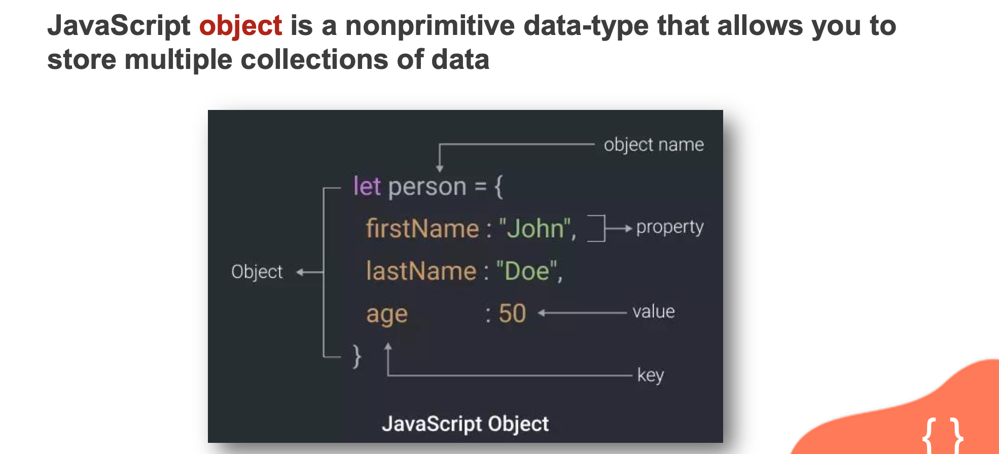
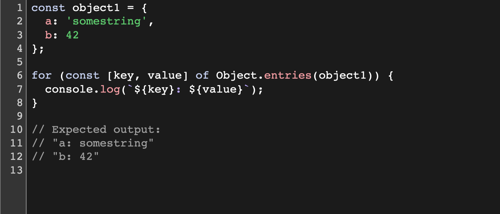
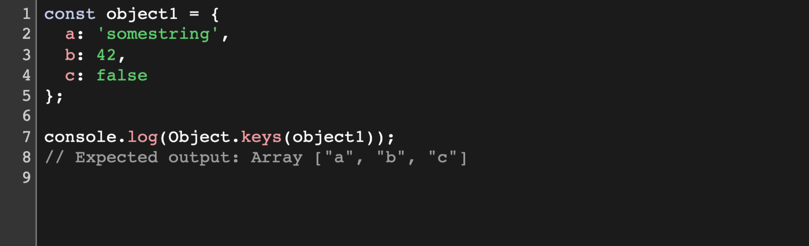
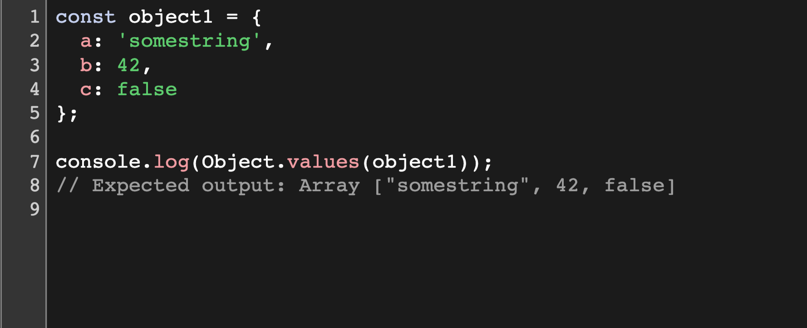
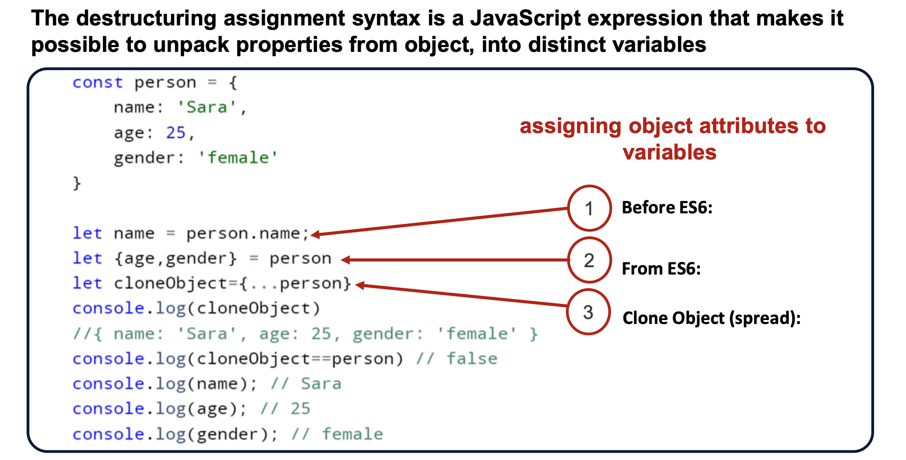
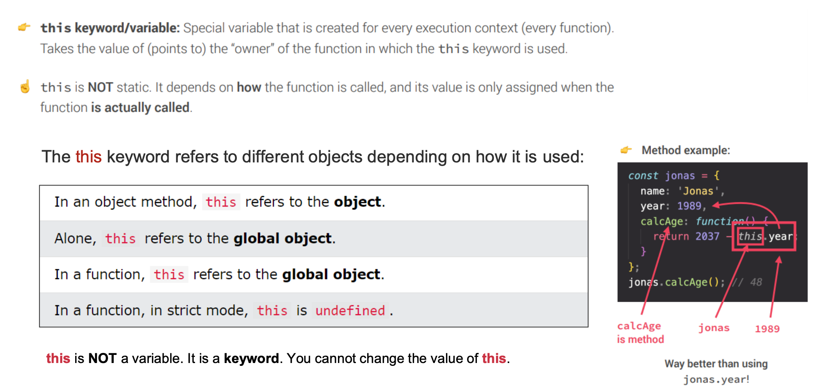
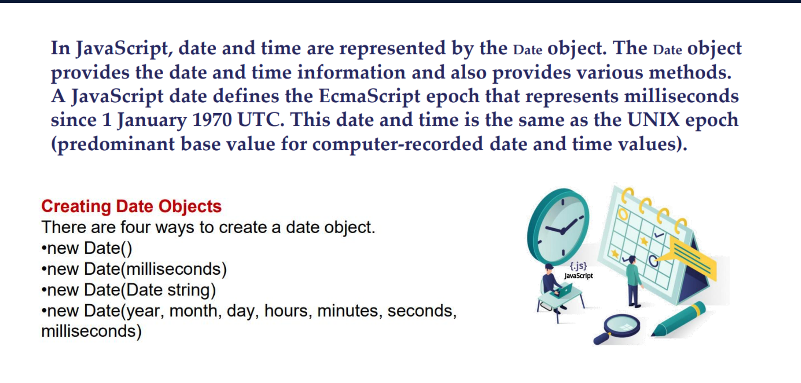
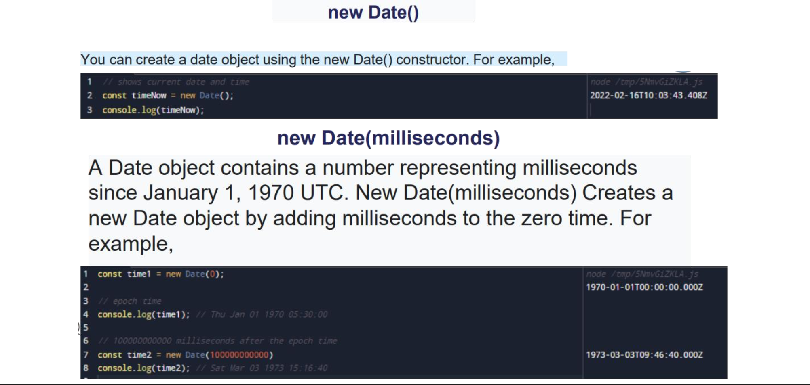
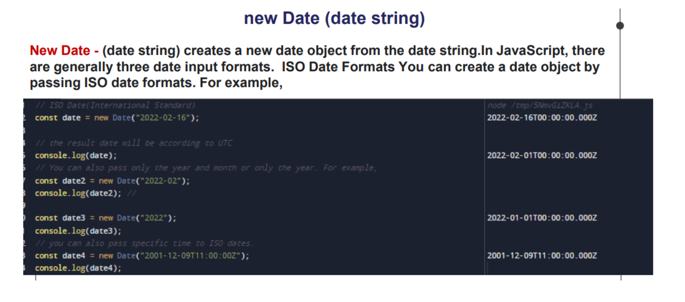
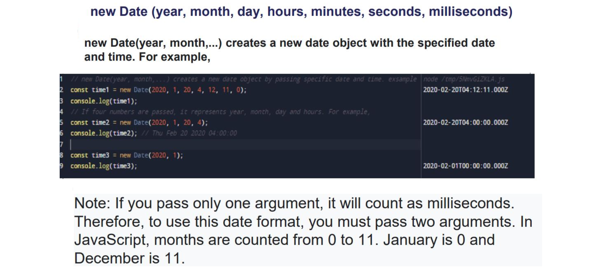

# Object in Java Script

>  In JavaScript, an `object` is a standalone entity, with properties and type. Compare it with a cup, for example. A cup is an object, with properties. A cup has a color, a design, weight, a material it is made of, etc. The same way, JavaScript objects can have properties, which define their characteristics. Everything is an object in JavaScript.

##  Object methods
- **`Object.entries()`**  
    >The `Object.entries()` static method returns an array of a given object's own enumerable string-keyed property key-value pairs.

- **`Object. keys()`**  
    >The `Object.keys()` static method returns an array of a given object's own enumerable string-keyed property names.

- **`Object. values()`**     
    >The `Object.values()` static method returns an array of a given object's own enumerable string-keyed property values.

##  Destructuring AND spread in object

## `This` in Java Script

## Data and time in Java Script

 

